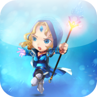

# Infodota (ex Dota 2 Info)

Author: Badretdinov Ayrat 
Contact: histlerbar@gmail.com 
        Dota 2 content and materials are trademarks and copyrights of Valve or its licensors. All rights reserved. This app is not affiliated with Valve. 
        Used data from 
<a href="http://dota2.com/">dota2.com</a> 
<a href="http://dota2.gamepedia.com/">dota2.gamepedia.com</a> 
<a href="http://dotabuff.com/">Dotabuff</a> 
<a href="http://www.twitch.tv/">TWITCH</a> 
<a href="http://www.joindota.com/">joinDOTA</a> 
<a href="http://trackdota.com">TrackDota</a> 
<a href="http://truepicker.com">TruePicker</a>  
Also used 
<a href="https://github.com/PhilJay/MPAndroidChart">MPAndroidChart</a> by Philipp Jahoda 
<a href="https://github.com/bumptech/glide">Glide</a> by Sam Judd 
<a href="http://jsoup.org/">Jsoup</a> by Jonathan Hedley 
<a href="https://github.com/koral--/android-gif-drawable">android-gif-drawable</a> by Karol Wrótniak 
<a href="https://github.com/pnikosis/materialish-progress">materialish-progress</a> by pnikosis 
<a href="http://nineoldandroids.com/">NineOldAndroids</a> by Jake Wharton 
<a href="https://github.com/square/retrofit">Retrofit</a> by Square, Inc. 
<a href="https://github.com/stephanenicolas/robospice">RoboSpice</a> by Octo Technology 
<a href="https://github.com/ApmeM/android-flowlayout">FlowLayout</a> by Artem Votincev 
appcompat and <a href="https://github.com/google/gson">Gson</a> by Google  
Also thanks to <a href="http://www.psdgraphics.com/">PSDgraphics</a> for app icon template (I've purchased license for 1 item) 

License
-------

    Copyright 2014-2015 Ayrat Badretdinov 

    Licensed under the Apache License, Version 2.0 (the "License");
    you may not use this file except in compliance with the License.
    You may obtain a copy of the License at

       http://www.apache.org/licenses/LICENSE-2.0

    Unless required by applicable law or agreed to in writing, software
    distributed under the License is distributed on an "AS IS" BASIS,
    WITHOUT WARRANTIES OR CONDITIONS OF ANY KIND, either express or implied.
    See the License for the specific language governing permissions and
    limitations under the License.
# SecretBrand
# SecretBrand
